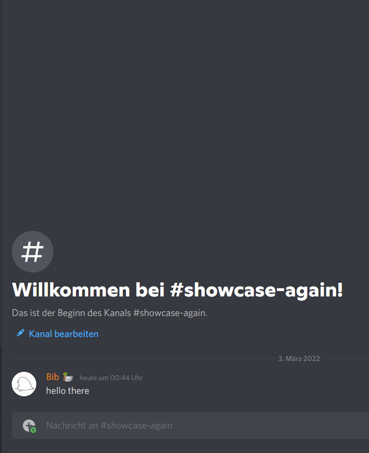
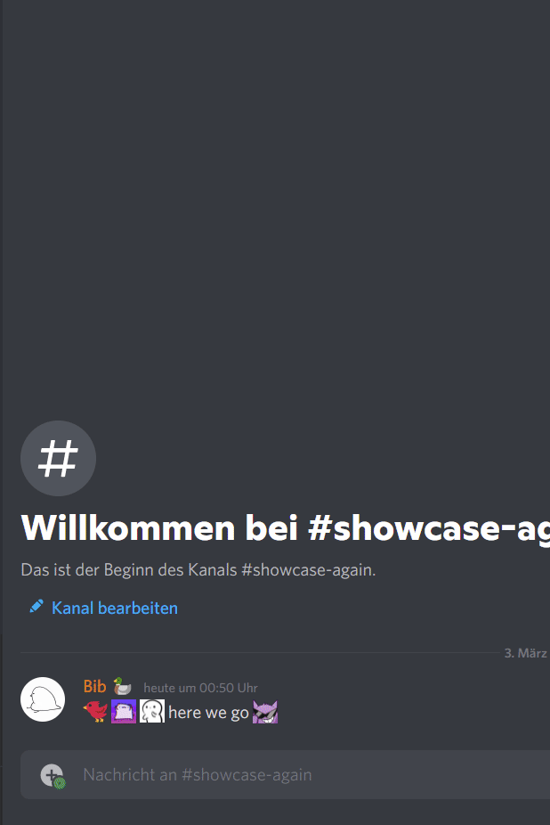
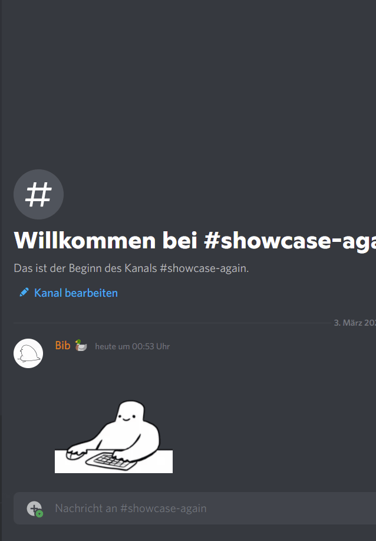
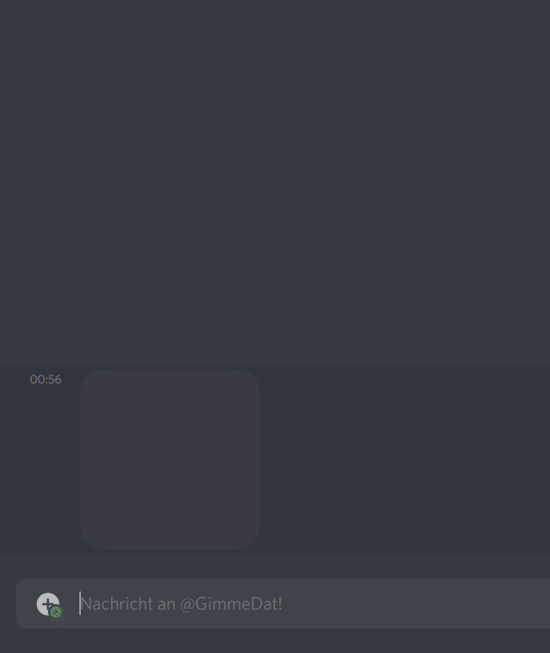

  <picture>
    
  </picture>

<h1 align="center">Gimme Dat Discord!</h1>

  <b>A Discord Bot to get User Profile, Emoji or Sticker Pictures.</b>

 

  
  
  

# Get User Profile Pictures
Right-clicking a profile picture lets you get the profile picture url.

Right-Click on Profile Picture -> Apps -> Gimme Dat

# Get Emoji Pictures
Right-clicking a message containing custom emojis lets you get the emoji picture
url.

Right-Click on Message-> Apps -> Gimme Dat

# Get Sticker Pictures
Right-clicking a message containing stickers lets you get the sticker picture
url.

Right-Click on Message-> Apps -> Gimme Dat

# DM the Bot
One can also directly message the bot with an emoji or sticker to get the
picture url.

# Invite the Bot
https://discord.com/api/oauth2/authorize?client_id=948190679614509127&permissions=2147483648&scope=bot%20applications.commands
